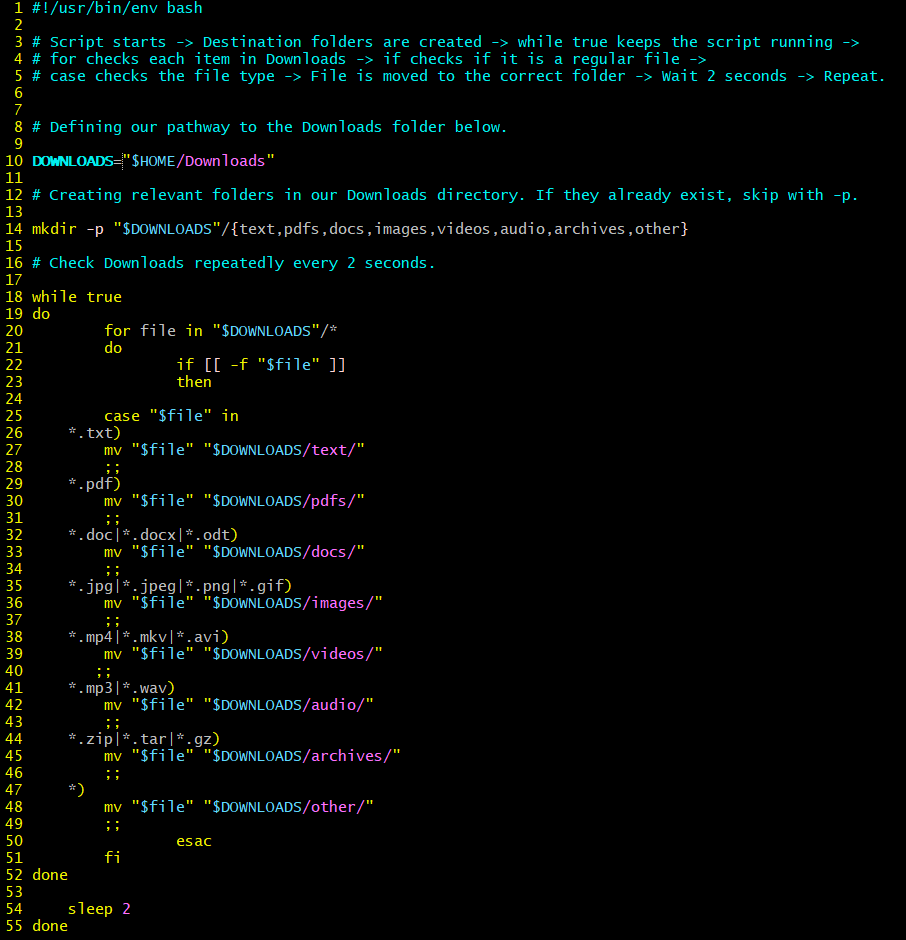

# dlorg - Downloads file organizer

dlorg is a bash script that automatically organizes files in the downloads directory.

# Features

- Automatically creates relevant folders in the Downloads directory.
- Automatically sorts files into these folders.
- Monitors the Downloads directory and keeps sorting new files as long as the script is running.

## Before running dlorg

## Running dlorg

## After running dlorg

## Installation

Clone the repository from GitHub.

Navigate to the repository directory.

Give the script permission to execute.

- Check that the script has permission to execute by typing: ls -l dlorg
The output should show an x in the file permission. If execution permission is missing, add it using: chmod +x dlorg

The scrips should now be ready to run.

## Usage

Navigate to the directory containing the dlorg script.
start the script by typing: ./dlorg
The scrips now monitors the Downloads directory and automatically moves files in the correct folders. The script is running untill manually stopped.

In order to stop the script, press CTRL+C in the terminal.

## Customization

The script can be customized depending if you want it to check a different directory or change how often it checks the targeted directory. Open the script using a text editor.
In the terminal, type: vim dlorg

- If you want to use the script to organize files in a different folder you can change the DOWNLOADS variable to your preferred directory pathway. The rest of the script uses this variable automatically. For example, if you want to organize the Documents directory, just change DOWNLOADS="$HOME/Downloads" to DOWNLOADS="$HOME/Documents".

- You can customize the directory folders by adding or removing folders that are created in the mkdir brackets.

- In the case "$file" in you can change, remove or add filetypes.

- This script checks the targeted directory every 2 seconds. To change to another timeframe, change the number 2 in "sleep 2" to your preffered timeframe.

## LLM Usage

LLM ChatGPT was used to help generate some parts of the script-code in order to avoid getting syntax errors in the while-loop and case file in parts of the code. 

## Thank you! :)

Have fun using this script!

Last updated: 2026-10-08  
