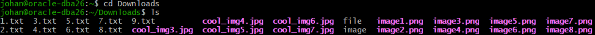
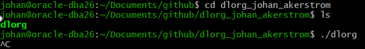
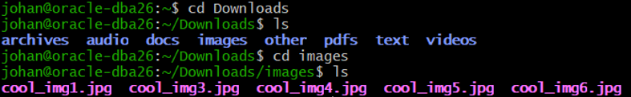

# dlorg - Downloads file organizer

dlorg is a bash script that automatically organizes files in the downloads directory.

# Features

- Automatically creates relevant folders in the Downloads directory.
- Automatically sorts files into these folders.
- Monitors the Downloads directory and keeps sorting new files as long as the script is running.

## Before running dlorg

## Running dlorg

## After running dlorg

